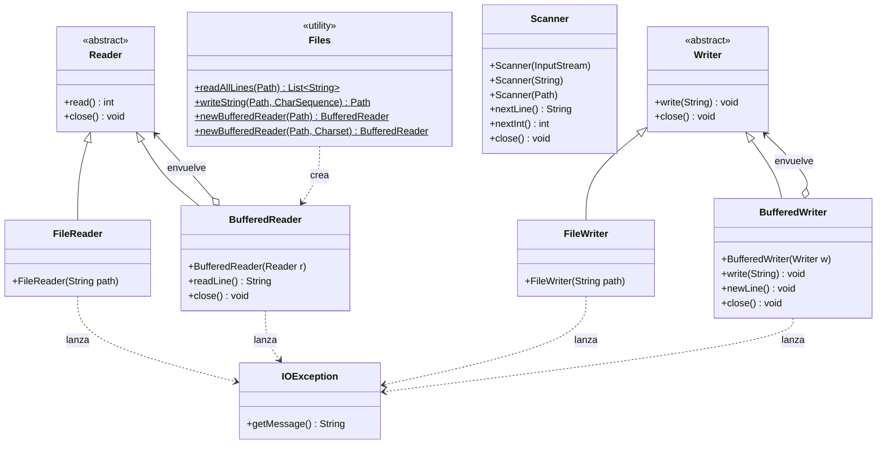

# Entrada y Salida (E/S) en Java

Notas de apoyo para el paquete `fundamentos.entradasalida`
(código fuente en [`src/fundamentos/entradasalida/`](../../../src/fundamentos/entradasalida/)).

El objetivo de este documento no es repetir cómo se usa `Scanner` o
`System.out.println` —eso ya se vio en clase— sino aclarar el **modelo
mental** detrás de la E/S: por qué existen tres canales, qué es un
flujo, por qué la E/S obliga a manejar excepciones y cómo leer y
escribir archivos a nivel básico.

---

## Mapa de clases del demo

Este diagrama muestra las clases del paquete `java.io` / `java.nio.file`
/ `java.util` que aparecen en `EntradaSalidaDemo` y sus relaciones. Sirve
como referencia para volver mientras se leen las secciones siguientes.

Convenciones (consistentes con [`docs/poo/figuras/diagrama-clases.md`](../../poo/figuras/diagrama-clases.md)):

| Notación Mermaid | Relación UML |
|---|---|
| `<\|--` | Herencia / generalización |
| `o-->`  | Asociación (referencia interna) |
| `..>`   | Dependencia / uso |
| `<<abstract>>` | Clasificador abstracto |
| `<<utility>>`  | Clase de utilidades estáticas |
| Sufijo `$` en un método | Método estático |



Ideas clave que el diagrama hace visibles:

- `FileReader`/`BufferedReader` son **ambas** subclases de `Reader`; lo
  mismo para `Writer`. Es decir, un `BufferedReader` **es** un `Reader`.
- `BufferedReader` además **envuelve** otro `Reader` (patrón decorador):
  por eso lo construyen pasándole un `FileReader` adentro.
- `Scanner` no hereda de `Reader`: es una clase aparte que **usa** un
  flujo de entrada por dentro. Por eso su constructor acepta múltiples
  tipos de fuente (`InputStream`, `String`, `Path`).
- `Files` es una **clase de utilidades** (métodos estáticos): no se
  instancia, sólo se invoca.
- `IOException` aparece como **dependencia** de las operaciones de
  archivos: cualquiera de ellas puede lanzarla.

---

## 1. Los tres canales estándar

Todo programa, en cualquier lenguaje, se comunica con el "mundo
exterior" a través de tres canales que el sistema operativo le entrega
al arrancar:

| Canal     | Nombre Unix | En Java        | Propósito                                |
|-----------|-------------|----------------|------------------------------------------|
| Entrada   | `stdin`     | `System.in`    | Datos que el programa **consume**        |
| Salida    | `stdout`    | `System.out`   | **Resultados** del programa              |
| Errores   | `stderr`    | `System.err`   | **Mensajes** del programa (errores, log) |

```
                       +-----------------+
   teclado -- stdin -->|                 |-- stdout --> pantalla (resultados)
                       |  Programa Java  |
                       |                 |-- stderr --> pantalla (errores)
                       +-----------------+
```

### ¿Por qué dos canales de salida en vez de uno?

La idea es **separar lo que el programa produce de lo que el programa
dice sobre sí mismo**. En la terminal, los dos se ven mezclados, pero
son tuberías distintas. Esto se nota cuando redirigís la salida a un
archivo:

```
                       +-----------------+
   teclado -- stdin -->|                 |-- stdout --> [ salida.txt ]
                       |  Programa Java  |
                       |                 |-- stderr ---> pantalla
                       +-----------------+

   $ java MiPrograma > salida.txt
```

Los **resultados** terminan en el archivo; los **errores** siguen
visibles en la terminal. Si todo se imprimiera por `System.out`, los
errores quedarían enterrados dentro del archivo de resultados y nadie
se enteraría de que algo falló.

Regla práctica: lo que es **dato útil** va por `System.out`; lo que es
**mensaje para el humano** (errores, progreso, advertencias) va por
`System.err`.

---

## 2. Flujos (streams)

`System.in`, `System.out` y `System.err` son instancias de unas clases
llamadas `InputStream` y `PrintStream`. La idea común a todas: un
**flujo** es una secuencia de bytes (o caracteres) que viaja entre el
programa y una fuente o destino.

Lo importante es que el *concepto* de flujo es el mismo, **cambie o no
la fuente**:

```
   Teclado:   [h][o][l][a][\n]  -->  Scanner(System.in)   -->  "hola"

   Archivo:   [h][o][l][a][\n]  -->  BufferedReader(...)  -->  "hola"
```

Por eso `Scanner` puede leer desde el teclado, desde un archivo o
incluso desde un `String` (como hace el bloque 2 del demo): el API es
el mismo, sólo cambia la fuente del flujo.

---

## 3. Manejo de excepciones en E/S

La E/S es la zona del programa donde más cosas pueden salir mal **por
causas que están fuera del código**:

- El archivo no existe.
- El programa no tiene permiso para leerlo o escribirlo.
- El disco está lleno.
- La red se cayó (en el caso de E/S de red).

Por eso Java marca casi todas las operaciones de E/S de archivos como
**operaciones que pueden lanzar `IOException`**, y obliga al
programador a manejar esa posibilidad. Esto se llama una excepción
"checked": el compilador no te deja ignorarla.

### El camino de una excepción

```
   br.readLine()
        |
        v
   El SO reporta: "archivo no existe"
        |
        v
   Java lanza IOException
        |
        +--> ¿hay try/catch?  -- sí -->  entra al catch, el programa sigue
        |
        +-->                  -- no -->  el método debe declarar "throws"
                                          y la excepción sube por la pila
```

### `try` / `catch` clásico

```java
try {
    // operación que puede fallar
} catch (IOException ex) {
    System.err.println("Falló: " + ex.getMessage());
}
```

### `try-with-resources`

Cuando se abre un recurso (archivo, conexión) hay que **cerrarlo**
siempre, aun si ocurre una excepción a mitad de camino. La forma
moderna y segura es declarar el recurso entre paréntesis del `try`:

```java
try (BufferedReader br = new BufferedReader(new FileReader("datos.txt"))) {
    // usar br
} catch (IOException ex) {
    System.err.println("Falló: " + ex.getMessage());
}
// br ya está cerrado acá, sin importar si hubo excepción.
```

Nota sobre `Scanner` con `System.in`: como `System.in` no es un archivo
que abra el programa, las llamadas básicas a `nextLine` / `nextInt`
**no** lanzan `IOException`. Por eso en los ejercicios con `Scanner` y
teclado no aparece el `try/catch`. Apenas se pasa a archivos, sí
aparece.

---

## 4. Archivos: lectura y escritura básica

### Escribir un archivo de texto

```java
try (BufferedWriter bw = new BufferedWriter(new FileWriter("salida.txt"))) {
    bw.write("Hola");
    bw.newLine();
    bw.write("Mundo");
    bw.newLine();
} catch (IOException ex) {
    System.err.println("Error escribiendo: " + ex.getMessage());
}
```

- `FileWriter` abre el archivo (lo crea si no existe; lo
  **sobrescribe** si existe).
- `BufferedWriter` acumula los bytes en memoria y los descarga al disco
  en bloques, en vez de uno por uno. Es mucho más eficiente.
- `newLine()` escribe el salto de línea adecuado al sistema operativo.

### Leer un archivo línea por línea

```java
try (BufferedReader br = new BufferedReader(new FileReader("salida.txt"))) {
    String linea;
    while ((linea = br.readLine()) != null) {
        System.out.println(linea);
    }
} catch (IOException ex) {
    System.err.println("Error leyendo: " + ex.getMessage());
}
```

`readLine()` devuelve `null` cuando llega al final del archivo: ese es
el criterio para terminar el bucle.

### Atajo moderno: `java.nio.file.Files`

Para casos simples, hay métodos de una sola línea:

```java
List<String> lineas = Files.readAllLines(Path.of("salida.txt"));
Files.writeString(Path.of("salida.txt"), "Hola\nMundo\n");
```

Internamente hacen lo mismo, pero ocultan el `BufferedReader`/`Writer`.
Igual hay que rodearlos con `try/catch` porque también pueden lanzar
`IOException`.

### `Files.newBufferedReader`: lo mejor de los dos mundos

Si se necesita un `BufferedReader` de verdad (para leer línea por
línea, por ejemplo) **y** además controlar la codificación, está
`Files.newBufferedReader`:

```java
try (BufferedReader br = Files.newBufferedReader(
        Path.of("salida.txt"),
        StandardCharsets.UTF_8)) {
    String linea;
    while ((linea = br.readLine()) != null) {
        System.out.println(linea);
    }
} catch (IOException ex) {
    System.err.println("Error: " + ex.getMessage());
}
```

Es equivalente a `new BufferedReader(new FileReader("salida.txt"))`,
con dos diferencias importantes:

- Construye el `BufferedReader` en una sola llamada (más corto).
- Permite indicar la **codificación** explícitamente
  (`StandardCharsets.UTF_8`), en vez de depender de la codificación
  por defecto del sistema operativo. Esto evita problemas con tildes y
  caracteres especiales cuando el archivo se mueve entre máquinas.

Es la forma recomendada en código moderno cuando importa el encoding.

---

## 5. Resumen visual

```
              +---- System.out  (resultados)
              |
   Programa --+---- System.err  (mensajes/errores)
              |
              +---- System.in   (datos de entrada)


   Misma idea, otras fuentes/destinos:

   FileReader / BufferedReader  <--- archivo --->  FileWriter / BufferedWriter
                                       |
                                  IOException
                                       |
                                  try / catch
```

---

## 6. Notas

- **Codificación**: `FileReader`/`FileWriter` usan la codificación por
  defecto del sistema operativo. Para garantizar UTF-8 de forma
  portable conviene usar `Files.newBufferedReader(path,
  StandardCharsets.UTF_8)`, como muestra el bloque 7 del demo.
- **Rutas relativas**: cuando el código dice `"salida.txt"`, el archivo
  se crea o se busca en el directorio desde el cual se ejecutó el
  programa (no necesariamente donde está el `.class`).
- **Ejecución del demo**:
  ```bash
  javac -d out -sourcepath src src/fundamentos/entradasalida/EntradaSalidaDemo.java
  java -cp out fundamentos.entradasalida.EntradaSalidaDemo
  ```
  La demo deja un archivo `salida.txt` en el directorio actual para
  que puedan inspeccionarlo.
