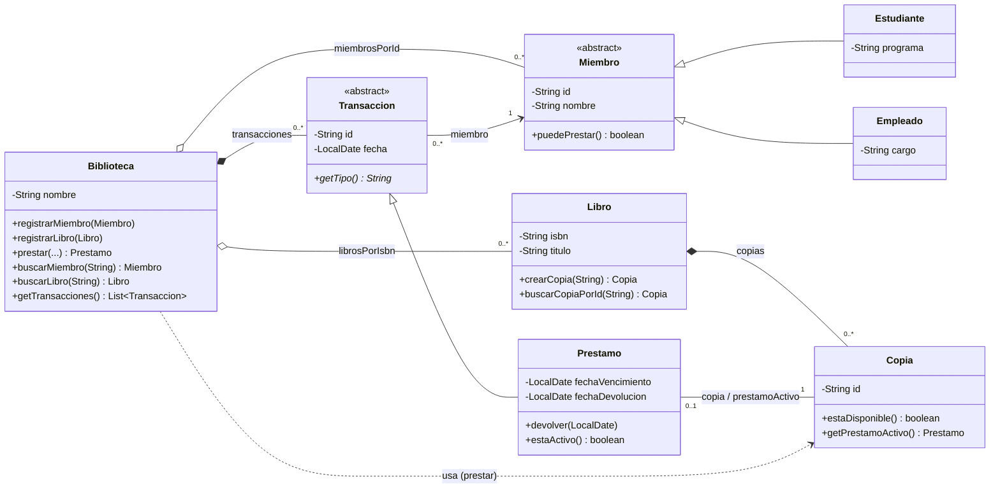

# Diagrama de clases — Sistema de Biblioteca

Diagrama UML del paquete `fundamentos.poo.biblioteca`
(código fuente en [`src/fundamentos/poo/biblioteca/`](../../../src/fundamentos/poo/biblioteca/)).

## Convenciones (UML 2.5.1)

| Notación Mermaid | Relación UML |
|---|---|
| `<\|--` | Herencia / generalización |
| `*--`  | Composición (`AggregationKind = composite` — la parte no existe sin el todo) |
| `o--`  | Agregación (`AggregationKind = shared` — ciclo de vida independiente) |
| `-->`  | Asociación unidireccional |
| `--`   | Asociación bidireccional |
| `..>`  | Dependencia / uso |

Referencia oficial: [UML 2.5.1 spec (OMG)](https://www.omg.org/spec/UML/2.5.1/PDF) — §11.5 *Associations* y §7.8 *Dependencies*.

## Diagrama

## Mapeo a fragmentos de código

| Relación | Tipo UML | Multiplicidad | Origen |
|---|---|---|---|
| Biblioteca → Miembro | Agregación (`shared`) | 0..* | [Biblioteca.java:18](../../../src/fundamentos/poo/biblioteca/Biblioteca.java#L18) |
| Biblioteca → Libro | Agregación (`shared`) | 0..* | [Biblioteca.java:24](../../../src/fundamentos/poo/biblioteca/Biblioteca.java#L24) |
| Biblioteca → Transaccion | Composición (`composite`) | 0..* | [Biblioteca.java:30](../../../src/fundamentos/poo/biblioteca/Biblioteca.java#L30) |
| Libro → Copia | Composición (`composite`) | 0..* (creadas en `crearCopia`) | [Libro.java:16](../../../src/fundamentos/poo/biblioteca/Libro.java#L16) |
| Transaccion → Miembro | Asociación unidireccional | 1..1 | [Transaccion.java:14](../../../src/fundamentos/poo/biblioteca/Transaccion.java#L14) |
| Prestamo ↔ Copia | Asociación bidireccional | 1..1 ↔ 0..1 | [Prestamo.java:11](../../../src/fundamentos/poo/biblioteca/Prestamo.java#L11), [Copia.java:18](../../../src/fundamentos/poo/biblioteca/Copia.java#L18) |
| Estudiante ▷ Miembro | Herencia | — | [Estudiante.java:3](../../../src/fundamentos/poo/biblioteca/Estudiante.java#L3) |
| Empleado ▷ Miembro | Herencia | — | [Empleado.java:3](../../../src/fundamentos/poo/biblioteca/Empleado.java#L3) |
| Prestamo ▷ Transaccion | Herencia | — | [Prestamo.java:6](../../../src/fundamentos/poo/biblioteca/Prestamo.java#L6) |
| Biblioteca ⇢ Copia (uso) | Dependencia (parámetro de `prestar`) | — | [Biblioteca.java:73-95](../../../src/fundamentos/poo/biblioteca/Biblioteca.java#L73) |

## Demostración ejecutable

El uso del modelo se muestra en [`BibliotecaDemo.java`](../../../src/fundamentos/poo/biblioteca/BibliotecaDemo.java) (correr con `make all && java -cp out fundamentos.poo.biblioteca.BibliotecaDemo`).
