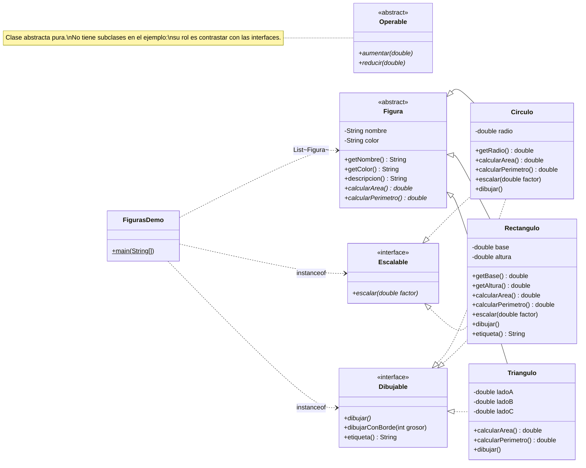

# Diagrama de clases — Figuras geométricas

Diagrama UML del paquete `fundamentos.poo.figuras`
(código fuente en [`src/fundamentos/poo/figuras/`](../../../src/fundamentos/poo/figuras/)).

Este ejemplo se centra en los conceptos de **herencia**, **clase abstracta**,
**clase abstracta pura**, **interfaz pura tradicional**, **interfaz con métodos
`default`** y **polimorfismo**. No usa composición ni agregación.

## Convenciones (UML 2.5.1)

| Notación Mermaid | Relación UML |
|---|---|
| `<\|--` | Herencia / generalización (entre clases) |
| `<\|..` | Realización / implementación de interfaz |
| `..>`   | Dependencia / uso |
| `<<abstract>>` | Clasificador abstracto |
| `<<interface>>` | Tipo interfaz |
| Sufijo `*` en un método | Método abstracto |
| Sufijo `$` en un método | Método estático |

Referencia oficial: [UML 2.5.1 spec (OMG)](https://www.omg.org/spec/UML/2.5.1/PDF) — §9 *Classification* y §10 *Interfaces*.

## Diagrama

## Lectura del diagrama

- **`Figura`** es una **clase abstracta** con estado (`nombre`, `color`) y un método concreto `descripcion()` que se apoya en los métodos abstractos `calcularArea()` y `calcularPerimetro()` (despacho dinámico).
- **`Circulo`**, **`Rectangulo`** y **`Triangulo`** heredan de `Figura` (línea sólida con triángulo `<|--`) y por tanto reciben el estado y `descripcion()`.
- **`Escalable`** y **`Dibujable`** son **interfaces** y se realizan con línea punteada con triángulo (`<|..`). Esto es lo que permite que `Circulo` "sea" simultáneamente un `Figura`, un `Escalable` y un `Dibujable`.
- **`Triangulo` no implementa `Escalable`**: ausencia deliberada para mostrar el filtrado polimórfico con `instanceof` en `FigurasDemo`.
- **`Dibujable`** trae métodos `default` (`dibujarConBorde`, `etiqueta`); las clases que la realizan los obtienen "gratis" salvo que decidan sobrescribirlos (lo hace `Rectangulo` con `etiqueta()`).
- **`Operable`** queda **huérfana** a propósito. Es una clase abstracta pura: contrato sin estado. Sirve para discutir por qué ese contrato, en Java moderno, se modela como interfaz y no como clase: una clase ya no podría además `extends Figura` por la herencia simple.

## Mapeo a fragmentos de código

| Relación | Tipo UML | Origen |
|---|---|---|
| Circulo ▷ Figura | Herencia | [Circulo.java:18](../../../src/fundamentos/poo/figuras/Circulo.java#L18) |
| Rectangulo ▷ Figura | Herencia | [Rectangulo.java:8](../../../src/fundamentos/poo/figuras/Rectangulo.java#L8) |
| Triangulo ▷ Figura | Herencia | [Triangulo.java:23](../../../src/fundamentos/poo/figuras/Triangulo.java#L23) |
| Circulo ⊳ Escalable | Realización | [Circulo.java:18](../../../src/fundamentos/poo/figuras/Circulo.java#L18) |
| Rectangulo ⊳ Escalable | Realización | [Rectangulo.java:8](../../../src/fundamentos/poo/figuras/Rectangulo.java#L8) |
| Circulo ⊳ Dibujable | Realización | [Circulo.java:18](../../../src/fundamentos/poo/figuras/Circulo.java#L18) |
| Rectangulo ⊳ Dibujable | Realización | [Rectangulo.java:8](../../../src/fundamentos/poo/figuras/Rectangulo.java#L8) |
| Triangulo ⊳ Dibujable | Realización | [Triangulo.java:23](../../../src/fundamentos/poo/figuras/Triangulo.java#L23) |
| `descripcion()` concreto que invoca `calcularArea()` abstracto (despacho dinámico) | — | [Figura.java:73-79](../../../src/fundamentos/poo/figuras/Figura.java#L73) |
| `dibujarConBorde(int)` como método `default` que invoca `dibujar()` abstracto | — | [Dibujable.java:42-55](../../../src/fundamentos/poo/figuras/Dibujable.java#L42) |
| `etiqueta()` sobrescrito en una subclase | — | [Rectangulo.java:64-67](../../../src/fundamentos/poo/figuras/Rectangulo.java#L64) |
| Filtrado polimórfico con `instanceof` (pattern matching) | — | [FigurasDemo.java:53-63](../../../src/fundamentos/poo/figuras/FigurasDemo.java#L53), [FigurasDemo.java:78-83](../../../src/fundamentos/poo/figuras/FigurasDemo.java#L78) |

## Demostración ejecutable

El uso del modelo se muestra en [`FigurasDemo.java`](../../../src/fundamentos/poo/figuras/FigurasDemo.java) (correr con `make all && java -cp out fundamentos.poo.figuras.FigurasDemo`).
